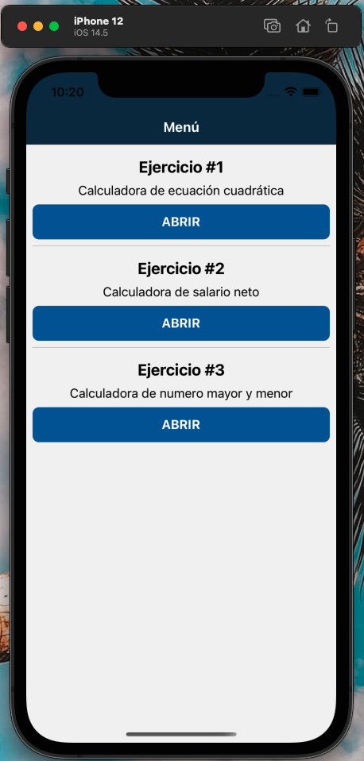
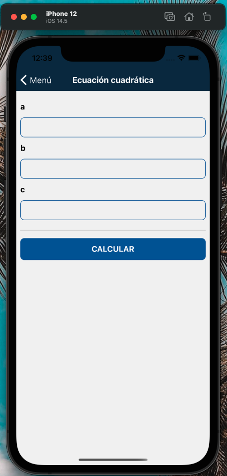
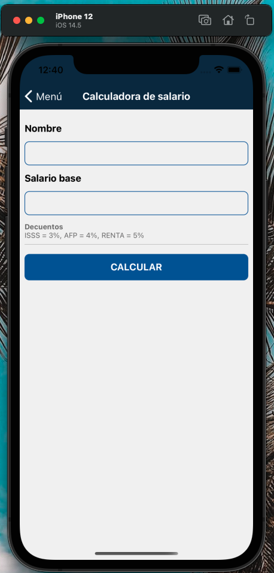
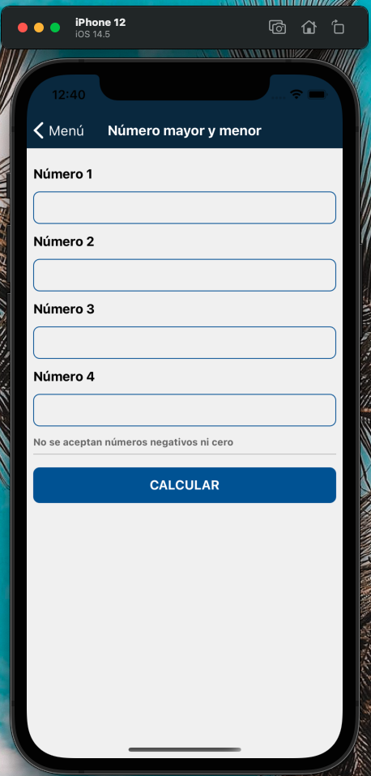

# DPS_Desafio1

##### Nombre
###### Leonardo Elenilson López Cañas
##### Carnet
###### LC171998
##### Laboratorio
###### DPSG04L

#### Menú

#### Ejercico 1 - Calculadora de ecuación cuadrática

#### Ejercico 2 - Calculadora de salario neto

#### Ejercico 3 - Calculadora de número mayor y menor
